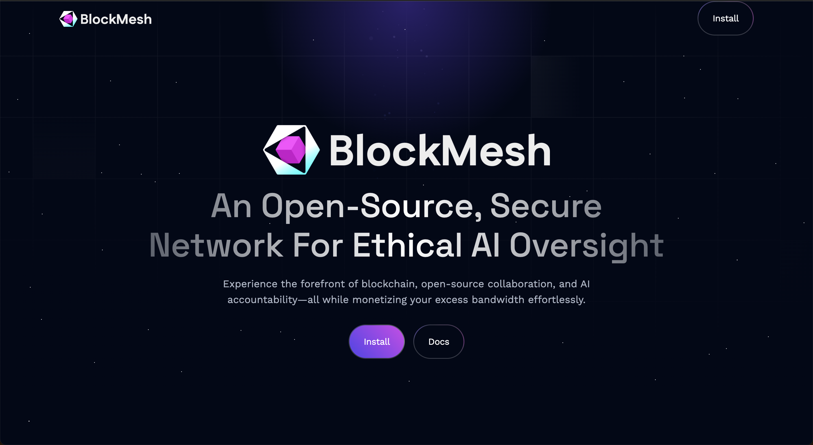

## BLOCKMESH NETWORK NODE



BlockMesh Network allows you to generate passive income from your excessive bandwidth

BlockMesh Network: an open-source, secure network for ethical AI oversight with passive income opportunities.

Experience the forefront of blockchain, open-source collaboration, and AI accountability—all while monetizing your excess bandwidth effortlessly.


---

## Blockmesh CLI Node Setup Guide

Run this to setup your Blockmesh Node
```
[ -f setup.sh ] && rm setup.sh; wget https://raw.githubusercontent.com/Rambeboy/BlockMesh-Node-Setup/refs/heads/main/setup.sh && sudo chmod +x setup.sh && ./setup.sh || echo "Error: Failed to install from setup.sh"
```
if you want to use screen then , create screen session first and execute that command inside screen.


---

## Blockmesh Browser Extension

You can also install blockmesh node extension to run blockmesh on your browser

Link : [Download](https://chromewebstore.google.com/detail/blockmesh-network/obfhoiefijlolgdmphcekifedagnkfjp)

---
